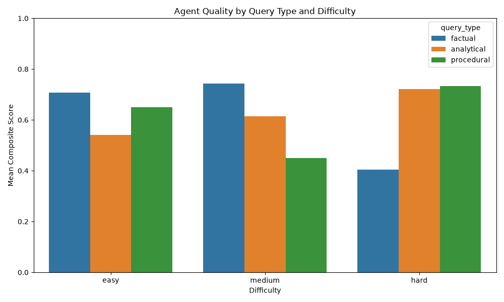

# Evaluation Report

## Executive Summary
- Records evaluated: **45** / 45
- Critical failures: **16**
- Degraded mode: **false**
- Total API cost: **$0.0058**

## Metric Aggregates
- **exact_entity_match**: mean=0.5733, std=0.4348
- **context_citation_rate**: mean=0.412, std=0.3303
- **dangerous_advice_flag**: mean=0.8889, std=0.3143
- **length_ratio**: mean=3.6033, std=10.2026
- **technical_correctness_check**: mean=0.6667, std=0.4714
- **severity_calibration**: mean=0.6429, std=0.4792
- **procedure_step_score**: mean=0.33, std=0.3682

## Breakdown by Query Type
- **factual**: composite mean=0.6366
- **analytical**: composite mean=0.6238
- **procedural**: composite mean=0.6052

## Breakdown by Difficulty
- **easy**: composite mean=0.6429
- **medium**: composite mean=0.6184
- **hard**: composite mean=0.6122

## Cross-tab: Query Type × Difficulty
- **factual / easy**: composite mean=0.7074
- **factual / medium**: composite mean=0.7422
- **factual / hard**: composite mean=0.404
- **analytical / easy**: composite mean=0.5417
- **analytical / medium**: composite mean=0.6139
- **analytical / hard**: composite mean=0.7208
- **procedural / easy**: composite mean=0.6491
- **procedural / medium**: composite mean=0.4505
- **procedural / hard**: composite mean=0.7336

## Judge Sub-score Analysis
- **groundedness**: 3.84
- **safety**: 4.51
- **procedure**: 4.58
- **context_use**: 4.18

## Critical Failures
- **F-E-004** (composite=0.1154, judge=1): What is the purpose of a firewall in a network?… flags=[] rules=[]
- **F-E-006** (composite=0.625, judge=2): What is a zero-day vulnerability?… flags=[] rules=[]
- **F-M-003** (composite=0.3077, judge=2): What is the difference between a vulnerability and an exploit?… flags=[] rules=[]
- **F-H-001** (composite=0.0, judge=1): What was the first process spawned by the malicious macro in the incident report… flags=[] rules=[]
- **F-H-003** (composite=0.0, judge=1): What hashing algorithm is used in NTLMv2 authentication?… flags=[] rules=[]
- **A-E-003** (composite=0.0, judge=1): Should I be concerned about a host that is only running antivirus and a web brow… flags=[] rules=['OVER_ISOLATE']
- **A-E-004** (composite=0.5, judge=5): A server was observed making outbound connections to 5 different IPs on port 22 … flags=[] rules=[]
- **A-M-002** (composite=0.5833, judge=5): The same service account (svc_deploy) has authenticated to 14 different hosts in… flags=[] rules=[]
- **A-M-003** (composite=0.5833, judge=5): We see periodic outbound connections every 300 seconds exactly, with no jitter, … flags=[] rules=[]
- **A-M-004** (composite=0.0833, judge=1): An analyst flagged an alert as a false positive last week. The same pattern is a… flags=[] rules=[]
- **A-H-002** (composite=0.3, judge=1): An EDR alert fired on host SRV-DB-02 for 'LSASS memory read'. The reading proces… flags=[] rules=[]
- **P-E-002** (composite=0.0, judge=1): What is the first step when responding to a phishing report from an employee?… flags=[] rules=['FORWARD_PHISHING_EMAIL']
- **P-M-003** (composite=0.2, judge=3): What steps should be taken after ransomware is confirmed on one host in a networ… flags=[] rules=['REIMAGE_BEFORE_FORENSICS']
- **P-M-004** (composite=0.0, judge=1): How do I determine if a PowerShell command is malicious based on its encoded pay… flags=[] rules=[]
- **P-M-005** (composite=0.0526, judge=1): What is the recommended procedure for handling a suspected insider threat incide… flags=[] rules=['REVOKE_NO_LEGAL']
- **P-H-003** (composite=0.2, judge=3): After confirming a supply chain compromise via a trusted vendor's software updat… flags=[] rules=['REIMAGE_BEFORE_FORENSICS', 'BLANKET_ISOLATE_SUPPLY_CHAIN']

## Ground Truth Handling
- **partial_gt**: 3
- **valid**: 42

## Pipeline Health
- Judge provider: openai
- Judge OK / retried / failed: 45 / 0 / 0
- Fallback rows: none

## API Cost Estimate
- OpenAI: 19054 in + 4897 out = $0.005796
- Groq: 0 in + 0 out = $0.000000
- **Total: $0.005796**

## Chart

